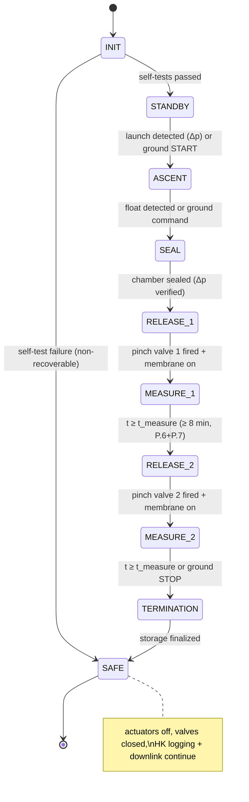

# SED §4.11 Software Design — revised draft for SED v1.2

Replacement text for BX38_CLOUDS_SED §4.11 (based on v1.1, 01 Mar 2026).
Fixes the six gaps identified in the v1.1 review (traceability table at the end).
Figures are given as Mermaid sources — render and insert as SED figures.

---

## 4.11 Software Design

### 1. Purpose

The onboard software performs three functions:

1. **Experiment control** — sequencing of the two-phase CaCO₃ release (pinch
   valves), membrane dispersion (push-pull solenoid, PWM), and chamber
   sealing (solenoid valves), executed **autonomously by default** with
   ground override (O.2).
2. **Data handling** — acquisition of spectrometer frames and environmental /
   attitude sensor data, redundant onboard storage (O.3), and downlink of a
   predetermined telemetry subset (O.4).
3. **Health and safety** — self-tests, watchdogs, fail-safe transitions, and
   error logging.

### 2. Design

#### a) Compute split and responsibilities

The software runs on two processors, matching the electronics design (§4.8):

| Processor | Software | Responsibilities |
|---|---|---|
| **RP2350** | Firmware, C/C++ (Pico SDK, PlatformIO) | **Authoritative experiment sequencer** (state machine below), actuator control (valves, membrane PWM), environmental/IMU sensor acquisition at 1 Hz (P.10, P.13), redundant logging to 2× SD via SPI, hardware watchdog |
| **Raspberry Pi 5** | Flight application, **Python 3** on Raspberry Pi OS Lite (64-bit), run as a `systemd` service | Spectrometer acquisition over USB at 1 Hz (P.3), storage of spectra + communication log to its SD card, E-Link communication (UDP down / TCP up), telemetry packetization, command forwarding to RP2350 over UART |

The **RP2350 owns the sequence**: it proceeds through the full experiment
autonomously even if the Raspberry Pi or the E-Link fails. The Pi is a data
and communications node; its loss degrades the mission (no spectra, no
downlink) but never blocks the particle release or sensor logging.

The Pi flight application reuses the driver/processing/calibration modules
already developed and hardware-verified in the team's ground software
(CLOUDS Spectral Engine: `spectro/` — EURECA DLL/USB driver pattern,
pixel→wavelength calibration, dark subtraction, averaging). Python on the
Pi 5 is fast enough by a wide margin: one 2048-px frame per second against
a measured readout capability of 450 fps.

#### b) Autonomy concept (O.2)

The sequence is **autonomous by default**; ground contact is an
opportunity to supervise, not a precondition:

- **Launch detection:** sustained ambient pressure drop (Keller 23SY),
  debounced over 60 s.
- **Float detection:** ambient pressure below 55 hPa **and** |dp/dt| below
  threshold for 5 min, **or** a fallback timer (T_float = 120 min after
  launch detection, configurable pre-flight) — whichever comes first.
- **Link-loss latch:** if no TCP heartbeat from ground for 10 min, the
  system latches into autonomous mode and ignores no further inputs are
  required; the two releases execute on float detection as scheduled.
- **Ground override:** while the link is up, ground can HOLD, RESUME,
  ABORT, or trigger each release early. Overrides are commands *into* the
  default sequence — there is no state that waits indefinitely for ground.

This satisfies O.2 exactly: two releases occur in flight with or without
the ground segment, and the full sequence is the default behaviour.

#### c) Process flow / state machine

Executed on the RP2350. Two release/measurement phases (two pinch valves,
fired independently) replace the single release of SED v1.0/v1.1.



| State | Actions |
|---|---|
| **INIT** | Boot, init sensors/SD/UART, self-tests (sensor plausibility, SD write test, actuator continuity), report status |
| **STANDBY** | 1 Hz housekeeping (HK) acquisition + logging + downlink; chamber open, ambient equalization valves open; arm launch detection |
| **ASCENT** | Continue HK; Pi records reference-conditions spectra; monitor for float |
| **SEAL** | Close both solenoid equalization valves; verify seal via chamber-vs-ambient pressure divergence; on failure → log, retry ×3, then proceed (measurement still valid, flagged) |
| **RELEASE_1 / _2** | Open pinch valve *n* (MOSFET, HW-interlocked), start membrane PWM (frequency/duty from config); verify actuation via current sense + chamber particle/pressure response |
| **MEASURE_1 / _2** | Spectra at 1 Hz on Pi; HK at 1 Hz on RP2350; membrane duty-cycled to hold dispersion ≥ 3 min (P.7); buffered redundant storage |
| **TERMINATION** | Membrane off, valves closed, flush buffers, close files cleanly on all 3 SD cards |
| **SAFE** | Fail-safe/idle: actuators disabled and de-energized, data preserved, HK + downlink continue, ground commands still accepted |

Any critical fault in any state (watchdog, undervoltage flag, storage
double-failure) transitions to **SAFE**. SAFE preserves all recorded data
and never re-enables actuators without an explicit ground RESUME.

#### d) Interfaces and communication

External (E-Link, Ethernet, per §4.2.2 and Table 6-3):

- **Downlink — UDP**, ~2 kbit/s continuous, occasional larger bursts
  (within 400 kbit/s max / 100 kbit/s avg). Packet loss is acceptable:
  every packet is self-contained (sequence number + timestamp + CRC-16).
- **Uplink — TCP**, ≤ 1 kbit/s: command channel with mandatory
  acknowledge. Command set: `PING` (heartbeat), `START`, `HOLD`, `RESUME`,
  `ABORT`, `RELEASE 1|2`, `SET_PARAM key value`, `STATUS?`.
  Safety-critical commands require a two-byte arm/execute pattern so a
  corrupted or truncated command can never fire an actuator.
- Two IP addresses: one for the Pi flight application, one reserved for
  GSE bench access through the same port.

Internal:

- **Pi ↔ RP2350 — UART**, framed protocol (COBS-encoded, CRC-16):
  RP2350 → Pi: 1 Hz HK packet (mirrored into the downlink), state changes,
  actuator events. Pi → RP2350: forwarded ground commands, time sync.
- **Time synchronization:** the Pi 5 carries a battery-backed RTC, set via
  NTP before roll-out. The Pi sends a timestamp message every 10 s; the
  RP2350 timestamps all HK/actuator records with the synchronized clock.
  Both spectra and HK therefore share one timebase (required by the §7.1
  paired analysis).
- Spectrometer ↔ Pi: USB (vendor DLL protocol). SD ↔ RP2350: SPI.
  Sensors: I²C/analog per device. Actuators: GPIO + PWM.

#### e) Data acquisition, storage, and downlink budget

Corrected for the actual spectrometer: the e9u-SPMD-350/850-10-Duo returns
one 2048-pixel × 16-bit frame (~4.1 kB) containing **both** fibre channels
(measurement and reference share one detector).

| Stream | Rate | Size | 5 h volume | Stored on |
|---|---|---|---|---|
| Spectra (full frames + header) | 1 Hz (P.3) | ~4.2 kB/frame | **~75 MB** | Pi SD |
| Housekeeping (2× temp, BME280, 2× pressure, IMU 6-axis, actuator/valve status) | 1 Hz | ≤ 256 B/record | ≤ 4.6 MB | 2× SD on RP2350 (redundant, O.3) |
| Event/error log | event-driven | — | ≪ 1 MB | all three SD cards |

Margins: > 100× on every card. Write strategy: RAM ring buffer (64 kB on
the Pi, 8 kB on the RP2350) with block writes sized to the SD sector, so
sustained write rate exceeds data rate by two orders of magnitude; a full
buffer can never occur in nominal operation, and on overflow the oldest
*downlink* copy is dropped, never the storage copy.

Downlink selection (O.4) — full spectra do **not** fit 2 kbit/s
(4.2 kB/s ≈ 34 kbit/s), so the predetermined subset is:

| Telemetry | Content | Rate | Bandwidth |
|---|---|---|---|
| HK packet | state, sensors, actuator status, CRC | 1 Hz, ~180 B | ~1.5 kbit/s |
| Quick-look spectrum | 8× pixel-binned frame (256 px × 2 B) both channels + header | 1 per 30 s, ~1.1 kB burst | ~0.3 kbit/s avg |
| Event messages | state changes, errors, command ACKs | sporadic | negligible |

Total ≈ 1.9 kbit/s average — inside the 2 kbit/s continuous figure, with
bursts far below the 400 kbit/s ceiling. All raw data is recovered from
the SD cards after landing; the downlink is for supervision and quick-look
science only.

#### f) Safety and reliability concepts

- **Watchdogs:**
  - RP2350: on-chip hardware watchdog, 2 s timeout, kicked from the main loop.
  - Pi 5: BCM2712 hardware watchdog supervised by `systemd`
    (`RuntimeWatchdogSec=15`), plus automatic service restart on crash.
  - **Mutual liveness:** each side monitors the other's UART traffic. Pi
    silent > 60 s → RP2350 logs it and continues the sequence autonomously
    (mission proceeds). RP2350 silent > 10 s → Pi raises a downlink alarm
    and logs; it cannot and must not take over sequencing.
- **Fail-safe state (SAFE):** actuators disabled and de-energized, valves
  driven closed once, all buffers flushed, files closed; HK and downlink
  continue so ground retains insight.
- **Data integrity:** CRC-16 on every stored record and downlink packet;
  sequence numbers detect loss; redundant HK storage on two SD cards;
  files rotated every 10 min so a corruption event costs at most 10 min
  of one stream.
- **Sanity checks:** every sensor reading validated against physical
  ranges (e.g. P.8 temperature window); implausible values are stored
  raw but flagged, never silently discarded.
- **Command safety:** TCP + ACK, arm/execute pattern for actuator
  commands, and the GSE-side interlock against ground-based particle
  release (§4.12).
- **Brownout/restart recovery:** on boot, the RP2350 reads its last
  persisted state + mission-elapsed time from SD and resumes the sequence
  rather than restarting it (a mid-flight reset must not re-run a release
  that already fired; fired-valve flags are persisted before actuation).

#### g) Modularization

| Module | Processor | Function |
|---|---|---|
| System Control | RP2350 | State machine (fig. above), persisted state, mission clock |
| Autonomy / Flight Detection | RP2350 | Launch/float detection, link-loss latch, timer fallbacks |
| Actuator | RP2350 | Valve GPIO (interlocked), membrane PWM, actuation verification |
| Sensor | RP2350 | 1 Hz acquisition, calibration application, sanity flags |
| Data Management | both | Ring buffers, block writes, file rotation, CRC |
| Communication | Pi (+UART stub on RP2350) | UDP telemetry, TCP command server, packetization, UART framing |
| Spectrometer | Pi | USB acquisition at 1 Hz, exposure control, dark handling (reusing ground-software `spectro/` modules) |
| Safety | both | Watchdog kicking, mutual liveness, SAFE transitions, error log |

Updated pseudocode (RP2350 sequencer core):

```
MAIN():
  restore_or_init_state()          // brownout-safe resume
  loop:
    kick_watchdog()
    read_sensors_1Hz(); log_redundant(); send_hk_uart()
    cmd = poll_uart_commands()     // forwarded ground commands, if any
    update_state_machine(cmd)

UPDATE_STATE_MACHINE(cmd):
  handle_override(cmd)             // HOLD / RESUME / ABORT / RELEASE n
  switch (state):
    INIT:        if self_tests_ok(): state = STANDBY else state = SAFE
    STANDBY:     if launch_detected() or cmd==START: state = ASCENT
    ASCENT:      if float_detected() or float_timer_expired(): state = SEAL
    SEAL:        close_equalization_valves(); verify_seal_or_flag()
                 state = RELEASE_1
    RELEASE_1:   fire_pinch_valve(1); membrane_pwm(on); persist_fired(1)
                 state = MEASURE_1
    MEASURE_1:   if elapsed() >= t_measure: state = RELEASE_2
    RELEASE_2:   fire_pinch_valve(2); membrane_pwm(on); persist_fired(2)
                 state = MEASURE_2
    MEASURE_2:   if elapsed() >= t_measure or cmd==STOP: state = TERMINATION
    TERMINATION: membrane_pwm(off); close_all_valves(); finalize_storage()
                 state = SAFE
    SAFE:        idle_monitor()    // logging + downlink continue
```

Note the machine never blocks on ground input: `START` and the release
commands are accelerators, the pressure/timer triggers are the defaults.

#### h) Auxiliary software items

- **Solar-position tool (supports §4.4):** the axicon is rotationally
  symmetric, so there is **no in-flight pointing and no flight-software
  task**. Solar elevation for the Esrange launch window (date/time/
  altitude) is computed by a pre-flight analysis script (standard solar
  ephemeris) to fix the axicon cone angle during design and to verify
  alignment during integration. §4.4's wording is aligned accordingly.
- **Camera (F.7):** a decision on flying a documentation camera is open.
  If adopted, it attaches to the Pi 5 (CSI), images are stored on the Pi
  SD only, with at most occasional thumbnails in the downlink burst
  budget. No sequencing dependency; F.7 will either be specified or
  deleted in SED v1.2.
- **F.6 note to electronics (§4.7):** humidity is required outside *and*
  inside the chamber — the software HK format reserves two humidity
  channels; the parts list currently has one BME280 and needs a second
  RH sensor (or a documented waiver).

#### i) Implementation and development process

- RP2350 firmware: **C/C++, Pico SDK, PlatformIO**, VS Code.
- Pi 5 application: **Python 3**, `systemd`-managed, Raspberry Pi OS Lite.
- Version control: Git (GitLab), feature branches + review.
- Testing: the Pi application runs against a **mock spectrometer driver**
  (no hardware needed, already proven in the ground software); the RP2350
  firmware is testable on a bench Pico 2 with simulated sensor inputs.
  End-to-end and autonomy behaviour are verified in T-07 (link-loss →
  full autonomous double release) and T-10.

---

## Traceability: v1.1 review gaps → this revision

| # | Gap in SED v1.1 | Fixed by |
|---|---|---|
| 1 | Single RELEASE state vs. O.2's two releases | RELEASE_1/MEASURE_1/RELEASE_2/MEASURE_2 states; per-valve fired-flags persisted |
| 2 | STANDBY blocked on ground command; no autonomous path | Autonomy module: launch/float detection + timer fallback + link-loss latch; sequence autonomous by default, ground can only override (§2b, T-07) |
| 3 | 16 B/sample data estimate vs. real 4 kB Duo frames | Corrected budget: ~75 MB spectra @ 1 Hz over 5 h; explicit downlink subset (HK 1 Hz + binned quick-look spectra) fitting 2 kbit/s (§2e) |
| 4 | Pi-side flight software unspecified | Specified: Python 3 / systemd / Pi OS Lite, reusing verified `spectro/` modules; responsibilities and watchdog defined (§2a, §2f) |
| 5 | Solar-position calc (§4.4) and camera (F.7) orphaned | Solar tool defined as pre-flight analysis script (no flight task); camera given a decision path and reserved interface (§2h) |
| 6 | F.6 needs two humidity locations, one BME280 listed | HK format reserves two RH channels; explicit action item for electronics (§2h) |
